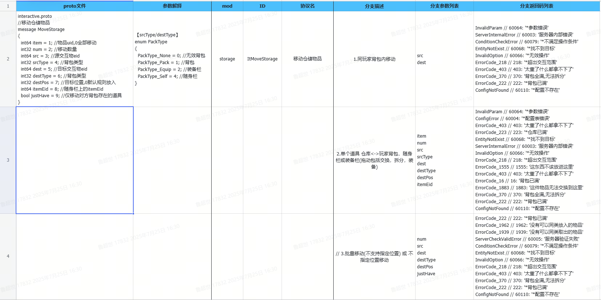

# CodeToDoc

基于 LLM 的代码文档转换工具

## 支持列表

### 解析特定 Proto 文件
```markdown
根据输入代码根目录的绝对路径，agent自动查找对应的代码，解析特定 Proto 文件，形成前后端协议交互文档。
```

#### 输入代码根目录的绝对路径
```markdown
E:\p4\git_servers
```

#### 输入协议提示
```markdown
message InteractiveInfo {
  MoveStorage moveStorage = 1; //移动仓储物品
}

enum InteractiveType
{
  ItMoveStorage = 3; // storage,移动仓储物品
}

//移动仓储物品
message MoveStorage
{
  int64 item = 1; //物品id,0全部移动
  int32 num = 2; //移动数量
  int64 src = 3; //源交互物eid
  int32 srcType = 4; //背包类型
  int64 dest = 5; //目标交互物eid
  int32 destType = 6; //背包类型
  int32 destPos = 7; //目标位置,0默认规则放入
  int64 itemEid = 8; //随身栏上的itemEid
  bool justHave = 9; //仅移动对方背包存在的道具
}
```

#### 输出表格
| proto文件                                                                 | 参数解释                                                                 | mod    | ID          | 协议名         | 分支描述                                                                 | 分支参数列表                          | 分支返回码列表                                                                 |
|--------------------------------------------------------------------------|--------------------------------------------------------------------------|--------|-------------|-----------------|--------------------------------------------------------------------------|---------------------------------------|--------------------------------------------------------------------------------|
| interactive.proto<br>//移动仓储物品<br>message MoveStorage<br>{<br>  int64 item = 1; //物品uid,0全部移动<br>  int32 num = 2; //移动数量<br>  int64 src = 3; //源交互物eid<br>  int32 srcType = 4; //背包类型<br>  int64 dest = 5; //目标交互物eid<br>  int32 destType = 6; //背包类型<br>  int32 destPos = 7; //目标位置,0默认规则放入<br>  int64 itemEid = 8; //随身栏上的itemEid<br>  bool justHave = 9; //仅移动对方背包存在的道具<br>} | 【srcType/destType】<br>enum PackType {<br>  PackType_None = 0; //无效背包<br>  PackType_Pack = 1; //背包<br>  PackType_Equip = 2; //装备栏<br>  PackType_Self = 4; //随身栏<br>} | storage | ItMoveStorage | 移动仓储物品   | 1.同玩家背包内移动                                                       | src<br>dest                           | InvalidParam // 60064: "*参数错误"<br>ServerInternalError // 60003: "服务器内部错误"<br>ConditionCheckError // 60007: "*不满足操作条件"<br>EntityNotExist // 60068: "*找不到目标"<br>InvalidOption // 60066: "*无效操作"<br>Error_Code_218 // 218: "*超出交互范围"<br>ErrorCode_403 // 403: "太重了什么都拿不下了"<br>ErrorCode_370 // 370: "背包全满,无法拆分"<br>ErrorCode_222 // 222: "*背包已满"<br>ConfigNotFound // 60110: "*配置不存在" |
|                                                                          |                                                                          |        |             |                 | 2.单个道具 仓库<<->>玩家背包，随身栏或装备栏(拖动包括交换，拆分，装备) | item<br>num<br>src<br>srcType<br>dest<br>destType<br>destPos<br>itemEid | InvalidParam // 60064: "*参数错误"<br>ConfigError // 60004: "*配置表错误"<br>ErrorCode_403 // 403: "太重了什么都拿不下了"<br>ErrorCode_223 // 223: "*仓库已满"<br>EntityNotExist // 60068: "*找不到目标"<br>ServerInternalError // 60003: "服务器内部错误"<br>InvalidOption // 60066: "*无效操作"<br>ErrorCode_218 // 218: "*超出交互范围"<br>ErrorCode_1555 // 1555: "这东西不该放进这里"<br>ErrorCode_403 // 403: "太重了什么都拿不下了"<br>ErrorCode_16 // 16: "背包已满"<br>ErrorCode_1883 // 1883: "这件物品无法交换到这里"<br>ErrorCode_370 // 370: "背包全满,无法拆分"<br>ErrorCode_222 // 222: "*背包已满"<br>ConfigNotFound // 60110: "*配置不存在" |
|                                                                          |                                                                          |        |             |                 | // 3.批量移动(不支持指定位置) 或 不指定位置移动                             | num<br>src<br>dest<br>destType<br>destPos<br>justHave                  | Error_Code_222 // 222: "*背包已满"<br>ErrorCode_1962 // 1962: "没有可以同类放入的物品"<br>ErrorCode_1399 // 1399: "没有可以同类取出的物品"<br>ServerCheckValidError // 60005: "服务器验证失败"<br>ConditionCheckError // 60007: "*不满足操作条件"<br>EntityNotExist // 60068: "*找不到目标"<br>InvalidOption // 60066: "*无效操作"<br>ErrorCode_218 // 218: "*超出交互范围"<br>ErrorCode_403 // 403: "太重了什么都拿不下了"<br>ErrorCode_370 // 370: "背包全满,无法拆分"<br>ErrorCode_222 // 222: "*背包已满"<br>ConfigNotFound // 60110: "*配置不存在" |

#### 输出图片
